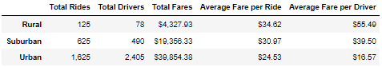
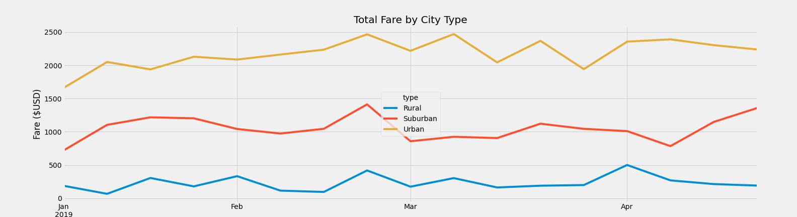

# PyBer: Ride-Sharing by City Type Analysis

## Overview of Project

### Purpose
Our team was tasked with organizing and analyzing a large amount of raw data by summarizing and visualizing the data by city type. By organizing the data into Urban, Suburban and Rural markets, we aimed to provide a comprehensive picture comparing the city types through statistical summaries and visualizations. Using these tools and gaining a better understanding of how the company is preforming in each market, we wanted to lay a foundaion where improvements to the business model can be placed, increasing customer satisfaction, market diversity and ultimately profits.

## Results

### Overview of City Comparison
By organizing different metrics by city type, we were able to see huge discrepencies among each of the categories. The urban cities had a large share of the market with 1,625 rides, over two and a half times the rides in suburban cities and thirteen times more than rural cities. Urban markets also have a considerbale more amount of drivers than both rural and suburban cities. However, it appears that while they have more drivers, the market is saturated. In Urban markets, there are roughly 50% drivers than total rides for this given time frame, compared to rural markets where the average driver completed 1.6 rides in the same period. As expected, cities also generated more money compared to the two other market types by roughly 100% and 825% respectively. However, rural and suburban cities outperormed their urban couterpart in both average fare per ride and average fare per driver. Suprisingly, the average fare per driver in rural cities was over triple the average fare in urban cities.

### Fares by Week Comparison
We were also able to visualize and confirm the variance in profitability by comparing the different city types by the total fares generated each week. While there werent any glaring trends from week to week in each of the different markets, we could again see that urban cities generated more revenue than suburban cities by a large margin and the same can be observed for suburban cities compared to rural ones.

## Summary
Based on our analysis, we were able to conclude that there were significant descrepencies between the different market types that could be improved upon. We think that by decentivizing urban drivers and incentivizing rural and suburban drivers, we could bring more drivers out of urban areas, which would increase efficiency and normalize our average fares. We could also do modeling and predictive analysis to determine the upper limit of the demand is in both rural and suburban markets to determine the most efficient ratio of drivers to rides. Using both of these tactics, we could finally optimize our marketing and target which market types we should seek out more drivers as well as a larger customer base. We feel that making these improvements would optimize Pyber's efficiency and increase profits.
